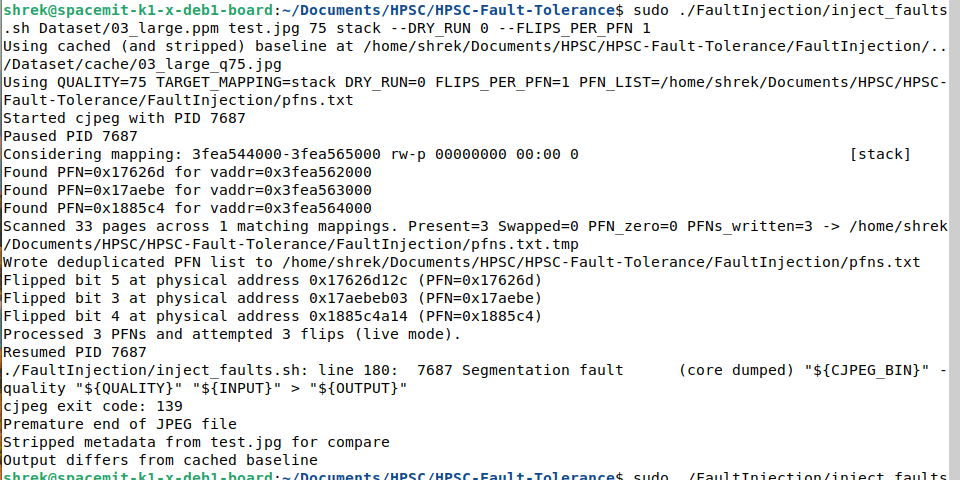
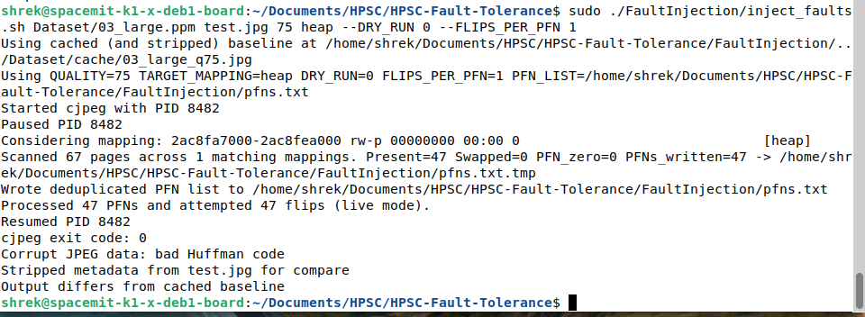
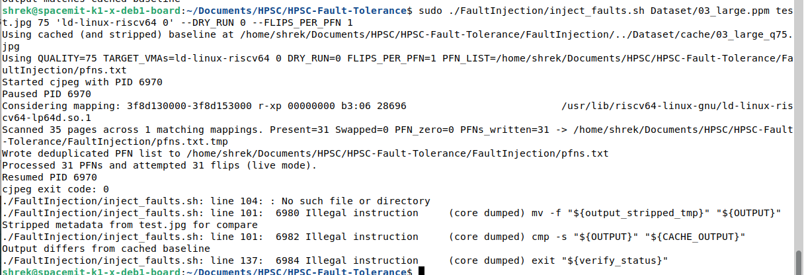

## Fault Injection for Image Compression

High level steps:

1. Begin image compression with the `cjpeg` tool, which comes from the libjpeg-turbo library.
    * This library is high quality and widely used for JPEG image compression. It is optimized for [hardware SIMD acceleration](https://libjpeg-turbo.org/About/SIMDCoverage), including RISC-V's RVV.
2. Pause process and get PID
3. Read virtual memory mappings
4. Find physical frames in RAM being used by different parts of the compression process (like stack, heap, etc)
5. Use Loadable Kernel Module (See `FaultInjection\faultmem\README.md`) to flip bits in the target frames, mimicking Single Event Upsets (SEU)
6. Resume compression and analyze failure

***
### How to Run

Follow instructions in `FaultInjection\faultmem\README.md` to install the LKM.

Install libjpeg-turbo utilities with `sudo apt install libjpeg-turbo-progs`.

Navigate to the root of this repo. Test the fault injection architecture with a dry run: `sudo ./FaultInjection/inject_faults.sh Dataset/03_large.ppm test.jpg 75 stack --DRY_RUN 1 --FLIPS_PER_PFN 1`. Check that PFNs are found and processed correctly.

Inject faults into the stack: `sudo ./FaultInjection/inject_faults.sh Dataset/03_large.ppm test.jpg 75 stack --DRY_RUN 0 --FLIPS_PER_PFN 1`. About half (?) the time, the program will segfault like so (with slightly less verbose output):

Similarly, the heap can be corrupted: `sudo ./FaultInjection/inject_faults.sh Dataset/03_large.ppm test.jpg 75 heap --DRY_RUN 0 --FLIPS_PER_PFN 1`. The image will usually become corrupted, like so:

If you corrupt `/usr/bin/cjpeg`, seems like you need to `sudo apt remove libjpeg-turbo-progs` and reinstall them.

If you corrupt `/usr/lib/riscv64-linux-gnu/ld-linux-riscv64-lp64d.so.1`, a system restart is required. More research is required to figure out how faulting the physical page impacts the version on disk.

***
### Understanding Memory Mapping

`trace_cjpeg_maps.sh` calls two helper scripts that sample and analyze memory mappings over time. We wanted to know if there was significant initialization periods that would effect when we wanted to inject faults into the process. We found that `cjpeg` creates 20 Virtual Memory Areas (VMA); an example can be found [here](./mapping_examples/results4/snapshots/maps_000001.txt).

We found that the only appreciable difference in the VMA's from start to finish is that the first anonymous mapping (after heap) changes 3 quarters through (shrinks a bit). Otherwise, we were safe to inject the faults at the very start of the program.

***
### Fault Injection

`inject_faults.sh`: main script.

`find_pfns.c`: takes in one or more target VMAs, then translates them to a list of PFN's that they are mapped to. Targets can be comma-separated, and each target can optionally include a 0-based occurrence index such as `/usr/bin/cjpeg 2` (third match). The special target `anon` matches VMAs with an empty label/pathname and can also be indexed (for example, `anon 0`). It uses VA's as indices in `/proc/<PID>/pagemap` to find their corresponding PNF. All present frames are written to a temporary .txt for further analysis.

`inject_pfn_faults.c`: takes PFNs from prev step and calls LKM to inject faults into the targeted region.

