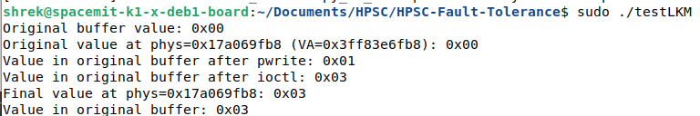

## faultmem LKM

Custom Loadable Kernel Module (LMK) for fault injection.

Provides read/write access to physical memory, circumventing the need for `/dev/mem` (which is protected by `CONFIG_STRICT_DEVMEM`). Tested on bainbuOS OS running on RISC-V SpacemiT K1 chip.

It supports 2 interfaces for fault injection:
* ioctl command (outlined in `include/faultmem.h`) that flips a bit at the specified physical address and bit index. This mode is easier to use for our SEU simulation purposes.
* Seeking, reading, and writing to the `/dev/faultmem` device as a direct substitute for `/dev/mem`. This gives the user more control over the type/length of error being injected. 

***
## How to Install and Test

To compile and install, run `./reload_faultmem.sh`. The device should appear at `/dev/faultmem`.

To test, run `gcc ./testLKM.c -o testLKM`, then `sudo ./testLKM`.

Expected output (with different memory values):

